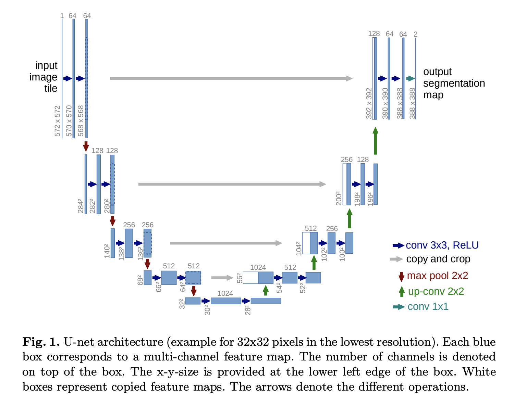

# Vision Transformer

Spread sheet including Results and related works is available in [here](https://docs.google.com/spreadsheets/d/1R7pa0ubrZRUp8cg0P3GwP9ZnYBqs1-Ymu_0BF6Xu9bs/edit?usp=sharing).

Dataset
-----------------------------------
Dataset is available in [here](https://ipp.cbica.upenn.edu/categories/brats2020).

1. Training: 3D MRI images from `369` patients (Height=240, Width=240, Depth=155)
    - Images: 4 modalities 
    - Masks: 4 classes(0, 1, 2, and 4)

 

2. Validation: 3D MRI images from `125` patients (Height=240, Width=240, Depth=155)
    - Images: 4 modalities


Models
-----------------------------------
1. SwinUNETR


2. UNETR


3. UNET




Metrics
------------------------------------
1. Dice Loss

Requirements
-----------------------------------
- git+https://github.com/Project-MONAI/MONAI#egg.gitmonai@0.8.1+271.g07de215c
- torch
- nibabel
- tqdm
- einops
- numpy
- SimpleITK

Install the requirements using command below:
```bash
pip install -r requirements.txt 
```
Run
--------------------------------------

```bash
python scripts.main --model swinunetr --epochs 10 --batch_size 2
```

References
---------------------------------------------------
- [3D Medical Image Segmentation](https://github.com/Project-MONAI/research-contributions/tree/main/UNETR/BTCV)