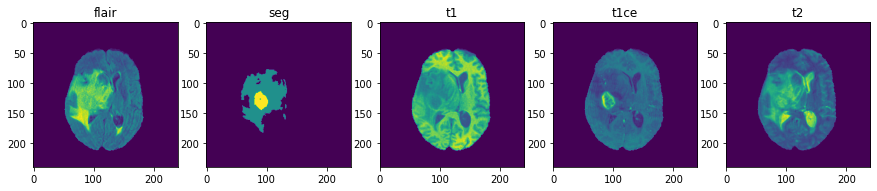
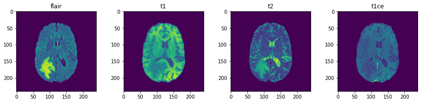
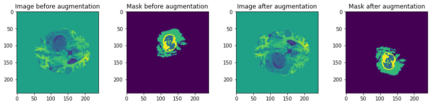
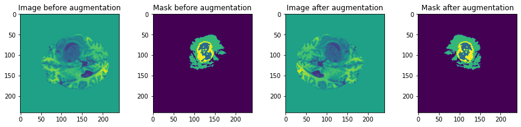
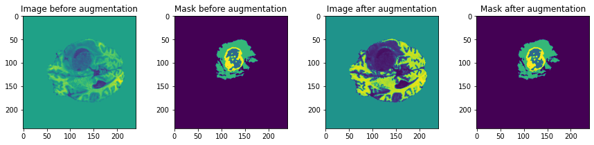
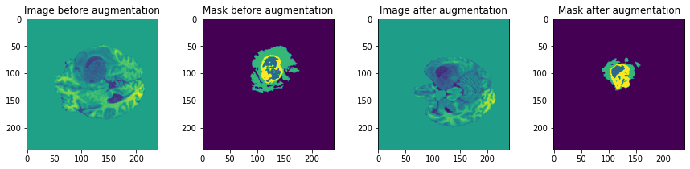
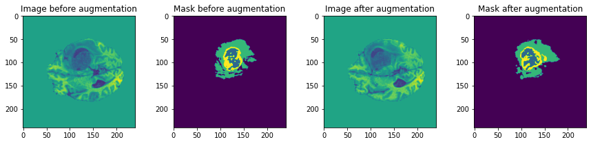
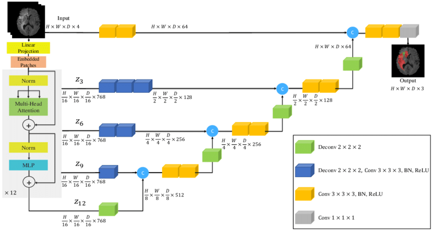

# BrainTumorSegmentation

Spread sheet including Results and related works is available in [here](https://docs.google.com/spreadsheets/d/1R7pa0ubrZRUp8cg0P3GwP9ZnYBqs1-Ymu_0BF6Xu9bs/edit?usp=sharing).

Dataset
-----------------------------------
Dataset is available in [here](https://ipp.cbica.upenn.edu/categories/brats2020).

1. Training: 3D MRI images from `369` patients (Height=240, Width=240, Depth=155)
    - Images: 4 modalities 
    - Masks: 4 classes(0, 1, 2, and 4)

 

2. Validation: 3D MRI images from `125` patients (Height=240, Width=240, Depth=155)
    - Images: 4 modalities




Preprocess and Augmentation
---------------------------------------
1. Flip



2. Brightness


3. Rotation


4. Elastic


5. Shift


6. Swirl


Models
-----------------------------------
1. UNETR



Metrics
------------------------------------
1. Dice Loss

Requirements
-----------------------------------
- torch==1.9.1
- monai==0.7.0
- nibabel==3.1.1
- tqdm==4.59.0
- einops==0.3.0
- tensorboardX==2.1

Install the requirements using command below:
```bash
pip install -r requirements.txt 
```
Run
--------------------------------------

For training **UNETR** model from scratch use this:
```bash
python scripts/main.py
--feature_size=32
--batch_size=1
--logdir=unetr_test
--fold=0
--optim_lr=1e-4
--lrschedule=warmup_cosine
--infer_overlap=0.5
--save_checkpoint
--data_dir=../Dataset_BRATS_2020/Training/
```

For fine-tunning **UNETR** model use this:
```bash
python scripts/main.py
--batch_size=1
--logdir=unetr_pretrained
--fold=0
--optim_lr=1e-4
--lrschedule=warmup_cosine
--infer_overlap=0.5
--save_checkpoint
--data_dir=../Dataset_BRATS_2020/Training/
--pretrained_dir='../pretrained_models/'
--noamp
--pretrained_model_name='UNETR_model_best_acc.pt'
--resume_jit
```

For testing **UNETR** model use this:
```bash
python scripts/test.py
--infer_overlap=0.5
--data_dir=../Dataset_BRATS_2020/Training/
--pretrained_dir='../pretrained_models/'
--saved_checkpoint=torchscript
```

References
---------------------------------------------------
- [3D Medical Image Segmentation](https://github.com/Project-MONAI/research-contributions/tree/main/UNETR/BTCV)